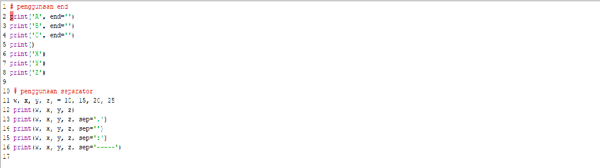
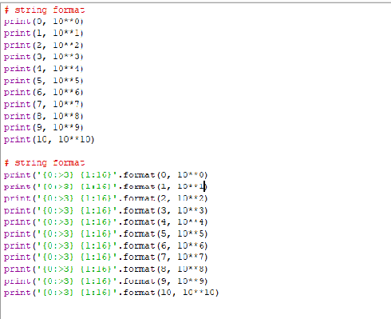

### NAMA:MUHAMAD ABDUL ANAS
### NIM:312210269
### KELAS:TI.22.A2

# PRAKTIKUM 3

#### Selanjutnya kita memerlukan nilai jari-jari (r) yang nantinya akan di masukan oleh pengguna pada layar console. Kita menggunakan fungsi input() yang nilainya di konversi ke tipe data float (bilangan riil). Ingat bahwa fungsi input() akan menganggap semua nilai inputan bertipe string, sehingga kita perlu melakukan konversi ke tipe yang diinginkan.Ketika kita sudah mendapat nilai phi dan jari-jari selanjutnya kita bisa menghitung luas dan keliling sesuai dengan rumus-nya masing-masing (lihat pada baris ke 3 & 4).Selanjutnya kita tampilkan hasilnya dengan fungsi print(). sintak \t merupakan karakter espace yang berfungsi untuk membuat tab. dalam kasus ini agar sejajar karakter sama dengan (=) nya.Jika dilihat hasil luas dan keliling lingkaran mempunyai angka pecahan yang cukup banyak, untuk mengambil 2 angka pecahan saja kita pakai fungsi format() Baris 1 : mendeklarasikan variable phi yang bernilai 3.14 .Baris 2 : mendeklarasikan dan melakukan input nilai jari-jari lingkaran ke dalam variable r.Baris 3 : perhitungan keliling dimana dua dikali dengan nilai variable phi dikali nilai variable r dan hasilnya akan dimasukkan kedalam variable k.Baris 4 : menampilkan nilai dari variable k.Dari hasil program, source code program menghitung keliling lingkaran tersebut berhasil dapat di compile dan dijalankan tanpa ada error dan saat panjang jari-jari diinput 10 maka menampilkan hasil perhitungan keliling lingkaran yaitu 62.80.
## Latihan1

